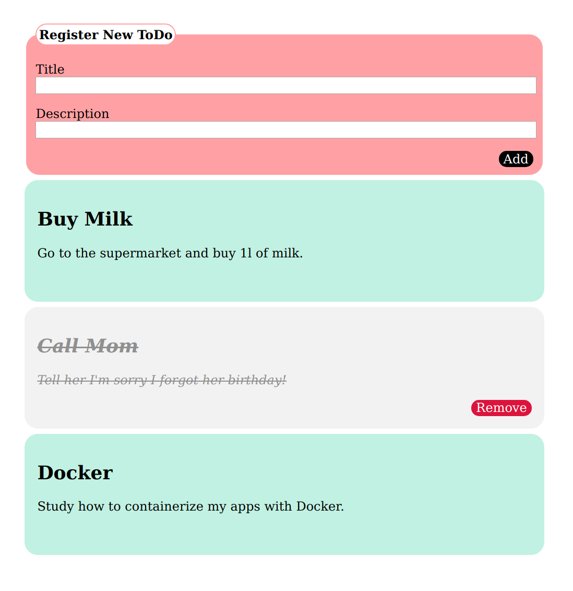

# &lt;/salt&gt;

## Salt ToDo

This is the classic Todo app exercise. Your task is to create a simple todo app - no backend required.
Exactly how you implement and design this is up to you - but your solution should be implemented in the files `index.html`, `js/todo.js` and `style/todo.css`. You may use the screenshot at the bottom of this page as inspiration.

There is a webpack-dev-server already set up for you to get started developing quickly. Get going with `npm run dev`.

You may not use any frameworks or libraries. SASS is OK.

### UI Requirements

- Initially, the list of todo cards should be empty.
- There should be a form where the user can add a new 'todo'.
- When a new todo task is submitted from the form, a new todo card should be appended to the list.
- Clicking on a todo card should visually mark the card as done. Exactly how is up to you. Clicking it again should toggle the card back to its original appearance.
- Add a remove-button to cards marked as 'done'. When the button is clicked, the card should be removed from the board.
- Move the cards marked as 'done' to the bottom of the list.

### Technical requirements

- Keep state in a object and _NOT_ in the DOM. In its simplest form, this means that the todo’s should be stored in an array. The view should be dependent on the state, not the other way around.
- Make sure your code adheres to the Airbnb’s ESlint-configuration we have provided.
- `Optional:` Persisting in [localstorage](https://developer.mozilla.org/en-US/docs/Web/API/Window/localStorage). This is actually really simple once you have a state object: store the current state in the browser's localstorage. When the app is closed and then opened again, the state should be restored.

### A few tips on the way

- Check the console, make sure it's clean before sending in the code
- Keep your code modular (build small functions, think that each function should have one single responsibility)
- Use modern JavaScript
- Think about naming your variables and functions in a way that make the code self-documenting
- Use consistent naming (e.g. don't mix camel case & hyphens)
- Use semantic html (e.g use the form element)
- Use a css reset or normalize (or sensible defaults for elements)

Have fun!!

|      |
| :-------------------: |
| Example of a todo app |

## Handing in the solution

Upload all the files of your app (_except for any node modules_) in a folder called `todo`.

## FAQ

Do we need to make the mobile view fully responsive?

> This is a good project to put in your own portfolio for later usage, i.e. make it good. But no, it's not one of the requirements.

When we hand it in - do we only upload the 3 files `index.html`, `todo.js` and `todo.css`?

> No, you should upload all the files of your app (_except for any node modules_).

Since the design is up to us, do we need to make sure our CSS works in good old Internet Explorer or can we skip that nightmare this time?

> No, it's not one of the requirements.

Does the type of the button matter? Like, is it expected to be "submit" since it's in a form, or is "button" fine as well?

> This test isn’t about details like that, but rather to create a well-functioning application and to show us some good, readable and consistent code. But what we can say is that it’s always a good idea to use semantic HTML.
